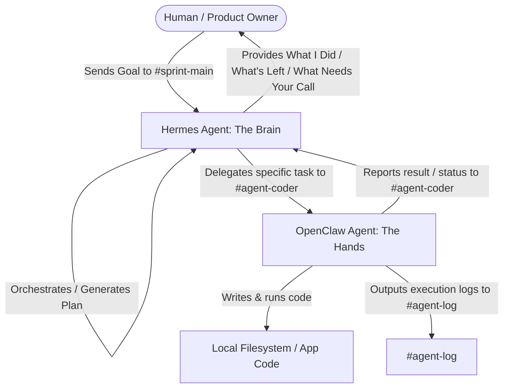

# System Architecture: Multi-Agent Workspace

This document defines the agent orchestration system built for the Forge 2 Qualifier.

---

## 1. Agent Roles

### Hermes (The Brain)
- **Role**: Planner, coordinator, and decision-maker.
- **Responsibilities**:
  - Receives high-level user instructions in `#sprint-main`.
  - Maintains persistent memory of requirements, database schema, and project state across chat sessions.
  - Decomposes complex projects into individual component tasks.
  - Reviews output reports from OpenClaw and decides on the next task or requests user input.

### OpenClaw (The Hands)
- **Role**: Coding execution agent.
- **Responsibilities**:
  - Listens to tasks dispatched by Hermes in `#agent-coder`.
  - Performs file modifications (write, update, patch) and runs commands (compilations, migrations, tests) in the workspace.
  - Returns raw console outputs and task status reports.

---

## 2. Slack Channel Scheme

To avoid channel clutter and keep the loop clean, we use three dedicated channels:

1. **`#sprint-main`**:
   - **Audience**: Human + Hermes.
   - **Purpose**: High-level alignment. The human posts goals, Hermes posts plans, and Hermes shares structured status reports.
2. **`#agent-coder`**:
   - **Audience**: Hermes + OpenClaw.
   - **Purpose**: Direct instruction. Hermes delegates specific coding actions, and OpenClaw responds with confirmations and summary reports.
3. **`#agent-log`**:
   - **Audience**: Auditing tools / Developer.
   - **Purpose**: Raw trace of command outputs, file writes, and process statuses for monitoring and debugging.

---

## 3. Model Routing

We employ a split-model routing strategy to maximize speed, cost-efficiency, and accuracy within the free tier limits:

| Agent | Task Type | Chosen Model | Provider | Rationale |
|---|---|---|---|---|
| **Hermes** (Brain) | Planning, Reasoning, Orchestration | `openai/gpt-oss-120b` (or `gemini-2.5-flash` fallback) | **Groq** / **Gemini** | Requires a model with high reasoning capacity and large context window to hold the full application architecture in memory. |
| **OpenClaw** (Hands) | Syntax execution, shell runner, minor edits | `qwen2.5-coder` (or `llama-3.3-70b-versatile` fallback) | **Ollama (local)** / **Groq** | Needs fast response speeds and has no rate limits when running locally. `qwen2.5-coder` is highly optimized for precise code creation. |
